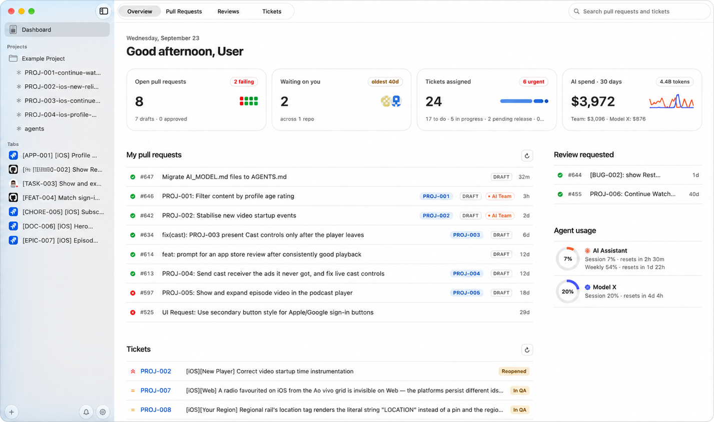

# Craft

**One workspace for your coding agents, pull requests, and tickets. Built for Mac.**

Running a few coding agents is easy. Keeping track of their branches, terminals,
changes, and reviews is the hard part. Craft gives every task its own git worktree,
agent, terminal, browser, files, and diff, and keeps your pull requests, review
queue, and Jira tickets one click away. It's free and open source under the
[MIT License](LICENSE).

[Download](https://github.com/alexcding/craft-mac/releases/latest) ·
[Features](#features) · [Connect your tools](#connect-your-tools) ·
[Build from source](#build-from-source) · [Contribute](#contribute) ·
[Report an issue](https://github.com/alexcding/craft-mac/issues)



## Features

### A worktree for every task

- **Start from anything.** Press ⌘N and type a branch name, or paste a GitHub pull
  request or Jira ticket link. Craft creates a git worktree for it (a new branch from
  the base you pick, or the pull request's own branch) and opens the page next to its
  terminal.
- **Run agents side by side.** Each session runs Claude Code, Codex, or a plain shell
  in its own checkout, so a feature and a bug fix never share files.
- **Steer the agent from the toolbar.** Switch model and effort presets (⌘D cycles
  models) and compact or clear the conversation. Click a stopped session in the
  sidebar to resume it.
- **Real terminals.** Sessions run in Ghostty-powered terminals owned by a separate
  daemon, so they keep running when you close the window and survive a crash.
  Quitting Craft stops them. Voice input works in terminals and agents once you allow
  microphone access in **Settings → General**.
- **Terminals that work with the rest of the window.** Drop files or images on a
  terminal to type their paths, and links a CLI opens appear in the panel beside it.
- **Worktrees set up the way you like.** In **Settings → Worktrees**, choose where
  worktrees live (next to the checkout, inside it, or a folder of your own), copy
  git-ignored files such as `.env*` into new ones (or commit a `.worktreeinclude`),
  fetch the base branch first, and delete a fully merged branch when its worktree is
  removed. Each
  project can run its own setup script in the background after a worktree is created.
- **Open in your tools.** Open any worktree in Xcode, VS Code, Cursor, Windsurf, Zed,
  IntelliJ IDEA, WebStorm, Android Studio, or an editor command of your own, and in
  Fork, Tower, Sourcetree, GitHub Desktop, or your own Git client command. For Xcode, Craft resolves Swift packages in the
  background before a new worktree opens, and deletes a removed worktree's
  DerivedData.

### Everything for the task in one window

- **Browser, Files, and Diff** views sit next to the session's terminal, plus
  **Simulator** while an iOS app runs.
- **Browser.** Tabs, bookmarks, history, downloads, and find in page. Keep the pull
  request, ticket, or documentation beside the agent working on it. Block ads with
  uBlock Origin Lite from the App Store (**Settings → Browser**).
- **Files.** Search the worktree, reopen recent files, and edit with syntax
  highlighting and an optional code minimap.
- **Review before you ship.** Inspect working changes, discard a single change block
  after a preview, search the branch history, and commit and push from the session.
  Craft warns you when the branch is behind its upstream.
- **Build and run Xcode projects.** Pick a scheme and destination, run with ⌘R, and
  stop with ⌘.. Stream a booted iOS Simulator into the session to watch the app while
  the agent works (needs Node.js 20 or later).

### A dashboard for what needs you

- **At a glance.** Open pull requests and failing CI, reviews waiting on you and how
  long the oldest has waited, assigned tickets by stage, and 30 days of AI spend.
  Click a pull request, review, or ticket tile to drill in.
- **Your PRs apart from your review queue.** Overview, Pull Requests, Reviews, and
  Tickets tabs, with one search across all of them. Right-click
  a pull request or ticket to open it in a tab or start a session on it.
- **Agent usage.** Claude Code and Codex rate limits for the current session and
  week, next to your AI spend.
- **Menu bar.** Review requests with their CI status and your agent usage (⇧⌘U). The
  icon turns bronze while a review is waiting.
- **Notifications** for new review requests (with an optional sound), merged and
  closed pull requests, and Jira transitions.
- GitHub refreshes in the background every minute and Jira every two minutes; change
  both in **Settings → Integrations**.

### Jira without leaving the code

- **Tickets.** Each project lists its tickets from your JQL, with search, filters, and
  a status menu on every row to transition a ticket.
- **Sprint board.** Drag cards between columns, move or reassign tickets, and filter
  by assignee.
- **Automatic updates.** [Automation](#automation-across-projects) can move a merged
  pull request's tickets to the status you choose, set a Fix Version, and comment on,
  assign, or label tickets.

### Automation across projects

Build pipelines in the **Automation** screen that watch every project:

- **Triggers.** A pull request is opened, marked ready for review, gets new commits,
  passes or fails CI, requests your review, is approved or gets changes requested,
  hits a merge conflict, merges, or closes. A Jira ticket newly matches a JQL query or
  changes status. Or run a pipeline by hand.
- **Filters.** Author, branches, labels, title, draft state, CI and review status,
  mergeability, size, changed paths, the linked Jira ticket's project, status, type,
  and priority, and time windows.
- **Actions.** On GitHub: approve (once per commit), request changes, comment, add or
  remove labels, request reviewers, assign, enable auto-merge, merge, close, update
  the branch, rerun failed checks, and mark ready for review. On Jira: transition, set
  a Fix Version, comment, assign, and label.
- **Try before it acts.** Dry-run a pipeline on a sample event before switching it on.
- **React right away.** Pipelines run on Craft's regular sync. Turn on **Forward
  webhooks to automations** in **Settings → Integrations** to react as soon as GitHub
  sends an event.
- Per-project merge settings from earlier versions become a pipeline automatically.

### Multi-step workflows

Save agent workflows per project: ordered steps for Claude Code or Codex, each with
a prompt and a goal Craft checks when the agent finishes its turn. Steps can use
`{url}`, `{key}`, `{pr}`, `{branch}`, `{repo}`, `{worktree}`, and `{workspace}`. Run
and stop a workflow from its session and follow each step's progress. Workflows need
the agent hooks from **Settings → Integrations**.

### Make it yours

- Light or dark appearance, a default agent for new sessions, terminal and editor
  fonts, and custom terminal keybinds.
- Menu shortcuts can be remapped in **Settings → Shortcuts**.
- Launch at login, CPU and memory use, and an activity log. The sidebar bell shows
  today's events.
- `craft://app/…` links open the overview, the terminal, a project section, or a
  session.
- Craft updates itself. Use **Check for Updates…** to check now.

## Install

Download the latest `Craft-X.Y.Z.dmg` from
[Releases](https://github.com/alexcding/craft-mac/releases/latest), open it, and drag
Craft to Applications. It needs an **Apple Silicon Mac** with **macOS 14 or later**.
The app is signed and notarized, and installs its own updates.

### Connect your tools

Craft works with the tools you already use. Connect only the ones you need:

| Tool | What it adds |
| --- | --- |
| [GitHub CLI (`gh`)](https://cli.github.com) | Pull requests, review requests, and CI status. Sign in with `gh auth login`. |
| Claude Code or Codex | Agent sessions using your installed CLI and its existing account. Choose **Shell only** to work without an agent. |
| [Atlassian CLI (`acli`)](https://developer.atlassian.com/cloud/acli/guides/install-macos/) | Jira tickets and status transitions. Sign in with `acli jira auth login`. |
| Jira API token | Sprint board columns and Fix Version automation. Add it in **Settings → Integrations**. |
| [`gh-webhook`](https://github.com/cli/gh-webhook) | Sends GitHub events to automation pipelines as they happen. Optional; polling works without it. |
| Node.js 20 or later | The iOS Simulator preview. |
| [`ccusage`](https://github.com/ryoppippi/ccusage) | The AI spend figures. Craft runs it through `bunx` or `npx` if it isn't installed. |

The setup assistant on first launch checks your tools and offers agent hooks, which
multi-step workflows need. Run it again from **Settings → Integrations**.

Craft has no account and no hosted backend. Your data stays on your Mac, in
`~/Library/Application Support/Craft`; see [data recovery](docs/DATA-RECOVERY.md) for
backups and restores.

## Build from source

1. Use an **Apple Silicon Mac**. Building the current source needs **Xcode 26 or
   later** for the macOS 26 SDK; the app itself runs on macOS 14 or later.
2. Clone the repository and open the Xcode project:

   ```bash
   git clone https://github.com/alexcding/craft-mac.git
   cd craft-mac
   open macos/Craft.xcodeproj
   ```

3. Select **Craft → My Mac** and press **⌘R**.

The build prepares the Rust backend and terminal helper, downloads the pinned
Ghostty runtime, and installs Rust through rustup if Cargo is missing. The first
build needs network access and takes longer; later builds are incremental. If you
already have Rust installed, the backend needs **Rust 1.88 or later**. Bootstrap
output is saved to `macos/.build/bootstrap.log`.

Craft is a SwiftUI and AppKit app with a Rust backend linked into the same process.
The backend refreshes GitHub and Jira in the background into local SQLite, so screens
read a snapshot instantly. A separate Rust daemon owns the shells, and WebKit hosts
the browser and the diff view. [AGENTS.md](AGENTS.md) walks through the architecture.

## Contribute

Craft is built around real development work, and you don't need to know Swift or
Rust, or write code at all, to help.

- **Try one real task** and tell us where setup, navigation, or the agent workflow
  felt confusing.
- **Report a bug.** [Open an issue](https://github.com/alexcding/craft-mac/issues/new)
  with steps to reproduce, expected and actual behavior, your macOS and Xcode
  versions, and relevant logs or screenshots. Remove credentials and private project
  details.
- **Improve a small piece.** Setup documentation, keyboard navigation, accessibility,
  error messages, and regression tests are good places to start.
- **Bring a workflow.** Show how you use agents, worktrees, or Jira, and the friction
  you'd like Craft to remove. Open an issue before a large change so we can agree on
  the approach.
- **Help people find it.** Star the repository, share it with a teammate, or post a
  walkthrough of a task you finished with Craft.

### Sending a pull request

Fork the repository, create a branch, and read [AGENTS.md](AGENTS.md) before making
changes. Keep the pull request focused, explain the problem and the resulting
behavior, and include screenshots for UI changes. Say how you verified it and which
checks you couldn't run.

After the first Xcode build has prepared the native dependencies, run the checks
that cover your change:

```bash
# Rust backend
cargo test --manifest-path crates/craft-backend/Cargo.toml

# Terminal daemon and snapshots
cargo test --manifest-path crates/craft-ptyd/Cargo.toml --features terminal-snapshots

# Native app unit tests
xcodebuild test -project macos/Craft.xcodeproj -scheme Craft \
  -derivedDataPath macos/.build/xcode -only-testing:CraftTests
```

Swift Testing can report success after running zero tests when filtered by a single
function name. Use the target-level command above and check the executed test count.

For deeper work, see the [native app guide](macos/README.md),
[terminal snapshot protocol](crates/craft-ptyd/SNAPSHOTS.md), and
[Ghostty patch guide](macos/patches/ghostty/README.md). Direct-distribution packaging
is documented in the [packaging guide](macos/README.md#direct-distribution-packaging).

## License and acknowledgments

Craft is free and open source under the [MIT License](LICENSE): anyone can use,
modify, and share it, including commercially.

Craft builds on [Ghostty](https://github.com/ghostty-org/ghostty),
[GhosttyTerminal](https://github.com/alexcding/ghostty-terminal-spm),
[CodeEditSourceEditor](https://github.com/CodeEditApp/CodeEditSourceEditor), and
[Sparkle](https://github.com/sparkle-project/Sparkle), alongside the CLI tools that
connect it to your work. Third-party dependencies retain their own licenses.
